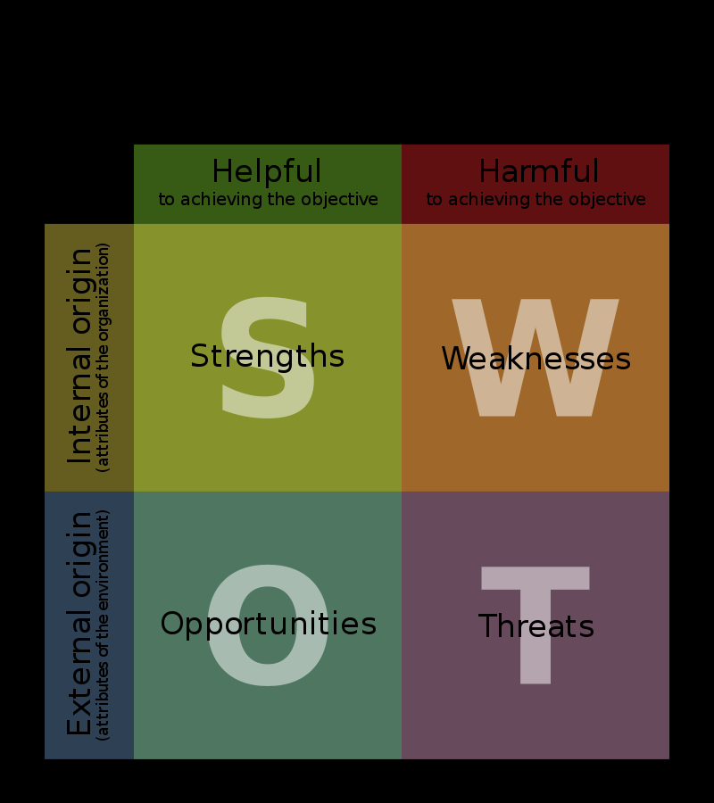

# Description
 It is a platform that allows peers to take quiz at the same time and judge their knowledge and calculation abilities.

## High Level Requirement
 Questions

## Low Level Requirement 
 There should be questions related to Science, Maths, General knoledge, and the subject they are learning

## Swot Analysis

## Strengths: 
            * Many Students or a group of students can take part at a time.
            * As it is a time scheduled quiz all participants will access it at same time.
            * As same question will appear for everyone at one time so copying of answeres is difficult.
## Weakness:
            * It may not give sufficient time to solve quiz.
            * It will result in many wrong answeres.
## Opportunities:
            * It can allow a organization to test their workers knowledge.
            * A school or college can use this as a weekly assesment.
## Threats:
            * If not updated on regulary it may get a hack.

## 4 Ws
## Who
Anyone can play this quiz like a game and organization may congigure it as they want.
## What
it is a game which allows peers to test their knowledge manu more.
## When 
As it is scheduled quiz it may be defined.
## Where
From where ever user is comfortable. it has no compulsions.

## How
* It can be executed by using c language.
* Making Structures and functions.
* Using multifile concept
 